# CDG Pulse V1 — Breadboard

Designed from Shape A parts. See `2026-02-20-cdg-pulse-v1-shaping.md` for requirements and shape.

---

## Places

| # | Place | Description |
|---|-------|-------------|
| P1 | VendorProfile (Public) | Existing profile page all members see; gains claim button + discovery CTAs |
| P2 | VendorProfile (Vendor Mode) | Dashboard layer on same route — renders when verified owner is logged in |
| P2.1 | Overview tab | Own stats: sentiment %, volume, trend |
| P2.2 | Respond tab | Reply composer for each mention |
| P2.3 | Intel tab | Market intelligence comparison panel |
| P3 | Claim Request Modal | Ownership claim submission form |
| P4 | Admin Claims Page | `/admin/claims` — approve/reject pending claims |
| P5 | Backend (Supabase) | Tables + RPCs |

---

## UI Affordances

| # | Place | Component | Affordance | Control | Wires Out | Returns To |
|---|-------|-----------|------------|---------|-----------|------------|
| U1 | P1 | VendorProfile | "Claim this profile" button | click | → P3 | — |
| U2 | P1 | VendorProfile | "Alternatives & Competitors" section header | render | — | — |
| U3 | P1 | VendorProfile | "See all [category] →" CTA | click | → /vendors?category= | — |
| U4 | P2 | VendorDashboard | _VendorProfile (Public) reference | — | → P1 | — |
| U5 | P2 | VendorDashboard | "Overview" tab | click | → P2.1 | — |
| U6 | P2 | VendorDashboard | "Respond" tab | click | → P2.2 | — |
| U7 | P2 | VendorDashboard | "Intel" tab | click | → P2.3 | — |
| U8 | P2.1 | VendorOverview | Sentiment % display | render | — | — |
| U9 | P2.1 | VendorOverview | Mention volume display | render | — | — |
| U10 | P2.1 | VendorOverview | Trend direction indicator | render | — | — |
| U11 | P2.2 | VendorRespond | Mentions list | render | — | — |
| U12 | P2.2 | VendorRespond | Reply textarea (per mention) | type | → N9 | — |
| U13 | P2.2 | VendorRespond | "Post reply" button | click | → N10 | — |
| U14 | P2.3 | VendorIntelPanel | Competitor comparison table | render | — | — |
| U15 | P2.3 | VendorIntelPanel | Own metrics row | render | — | — |
| U16 | P2.3 | VendorIntelPanel | Competitor metric rows | render | — | — |
| U17 | P3 | ClaimModal | Claimant name input | type | — | — |
| U18 | P3 | ClaimModal | Claimant email input | type | — | — |
| U19 | P3 | ClaimModal | Note textarea | type | — | — |
| U20 | P3 | ClaimModal | "Submit claim" button | click | → N4 | — |
| U21 | P3 | ClaimModal | Cancel button | click | → P1 | — |
| U22 | P4 | AdminClaims | Pending claims list | render | — | — |
| U23 | P4 | AdminClaims | Claim detail row (name, email, company, note, date) | render | — | — |
| U24 | P4 | AdminClaims | "Approve" button | click | → N14 | — |
| U25 | P4 | AdminClaims | "Reject" button | click | → N15 | — |

---

## Code Affordances

| # | Place | Component | Affordance | Control | Wires Out | Returns To |
|---|-------|-----------|------------|---------|-----------|------------|
| N1 | P1 | VendorProfile | `useVendorOwnership()` — SELECT vendor_profiles WHERE user_id = auth.uid() AND vendor_name = slug AND is_approved = true | call | — | → (P2 render gate) |
| N2 | P5 | Supabase | vendor_profiles SELECT (RLS-enforced) | query | — | → N1 |
| N3 | P3 | ClaimModal | form state (name, email, note) | write | — | → U17, U18, U19 |
| N4 | P3 | ClaimModal | `submitClaim()` — validates + inserts to vendor_claims | call | → N5 | — |
| N5 | P5 | Supabase | vendor_claims INSERT | call | — | → N4, → P1 (on success) |
| N6 | P4 | AdminClaims | `fetchPendingClaims()` — vendor_claims SELECT WHERE status = 'pending' | call | → N7 | — |
| N7 | P5 | Supabase | vendor_claims SELECT | query | — | → N6, → U22 |
| N8 | P4 | AdminClaims | `approveClaim(claimId, userId, vendorName)` | call | → N12, → N13 | — |
| N9 | P2.2 | VendorRespond | `replyDraft` store (per mention) | write | — | → U12 |
| N10 | P2.2 | VendorRespond | `submitReply()` via existing `useVendorResponses` hook | call | → N11 | — |
| N11 | P5 | Supabase | vendor_responses INSERT (existing) | call | — | → N10, → U11 |
| N12 | P5 | Supabase | vendor_profiles INSERT (new approved row) | call | — | → N8 |
| N13 | P5 | Supabase | vendor_claims UPDATE status = 'approved' | call | — | → N8, → U22 |
| N14 | P4 | AdminClaims | `approveClaim()` — delegates to N8 | call | → N8 | — |
| N15 | P4 | AdminClaims | `rejectClaim()` — vendor_claims UPDATE status = 'rejected' | call | → N16 | — |
| N16 | P5 | Supabase | vendor_claims UPDATE status = 'rejected' | call | — | → N15, → U22 |
| N17 | P2.1 | VendorOverview | `get_vendor_pulse_vendor_profile(vendorName)` — existing RPC | call | — | → U8, U9, U10 |
| N18 | P2.3 | VendorIntelPanel | `get_compared_vendors(vendorName)` — existing RPC | call | → N19 | — |
| N19 | P2.3 | VendorIntelPanel | `fetchCompetitorStats()` — calls `get_vendor_pulse_vendor_profile()` per competitor | call | — | → U14, U15, U16 |

---

## Data Stores

| # | Place | Store | Description |
|---|-------|-------|-------------|
| S1 | P5 | `vendor_claims` | New table: claim requests with status (pending/approved/rejected) |
| S2 | P5 | `vendor_profiles` | Existing: user_id → vendor_name, is_approved |
| S3 | P5 | `vendor_responses` | Existing: vendor replies to mentions |
| S4 | P2.2 | `replyDraft` | Per-mention reply text (local state) |

---

## Slices

| # | Slice | Mechanisms | Affordances | Demo |
|---|-------|------------|-------------|------|
| V1 | Dashboard gate | A3 | N1, N2, U4–U7, P2 | "Verified vendor visits their profile, sees dashboard tabs above public content" |
| V2 | Claim request flow | A1 | U1, U17–U21, N3–N5, S1 | "Member clicks 'Claim this profile', fills form, submits — claim stored in Supabase" |
| V3 | Admin claim approval | A2 | U22–U25, N6–N8, N12–N16 | "Admin sees pending claims at /admin/claims, approves one, vendor_profiles row created" |
| V4 | Respond to reviews | A4 | U11–U13, N9–N11, S3, S4 | "Vendor opens Respond tab, types reply to a mention, reply appears inline" |
| V5 | Market intel panel | A5 | U14–U16, N18, N19 | "Vendor opens Intel tab, sees their metrics vs top 3 competitors side-by-side" |
| V6 | Member discovery CTAs | A6 | U2, U3 | "Member sees 'Alternatives & Competitors' section with 'See all [category] →' link" |

---

## Diagram

```mermaid
flowchart TB
    subgraph P1["P1: VendorProfile (Public)"]
        U1["U1: Claim this profile btn"]
        U2["U2: Alternatives & Competitors header"]
        U3["U3: See all category CTA"]
        N1["N1: useVendorOwnership()"]
    end

    subgraph P2["P2: VendorProfile (Vendor Mode)"]
        U4["_VendorProfile Public"]
        U5["U5: Overview tab"]
        U6["U6: Respond tab"]
        U7["U7: Intel tab"]

        subgraph P2_1["P2.1: Overview"]
            U8["U8: Sentiment %"]
            U9["U9: Mention volume"]
            U10["U10: Trend direction"]
            N17["N17: get_vendor_pulse_vendor_profile()"]
        end

        subgraph P2_2["P2.2: Respond"]
            U11["U11: Mentions list"]
            U12["U12: Reply textarea"]
            U13["U13: Post reply btn"]
            N9["N9: replyDraft store"]
            N10["N10: submitReply()"]
        end

        subgraph P2_3["P2.3: Intel"]
            U14["U14: Comparison table"]
            U15["U15: Own metrics row"]
            U16["U16: Competitor rows"]
            N18["N18: get_compared_vendors()"]
            N19["N19: fetchCompetitorStats()"]
        end
    end

    subgraph P3["P3: Claim Request Modal"]
        U17["U17: Name input"]
        U18["U18: Email input"]
        U19["U19: Note textarea"]
        U20["U20: Submit claim btn"]
        U21["U21: Cancel btn"]
        N3["N3: form state"]
        N4["N4: submitClaim()"]
    end

    subgraph P4["P4: Admin Claims Page"]
        U22["U22: Pending claims list"]
        U23["U23: Claim detail row"]
        U24["U24: Approve btn"]
        U25["U25: Reject btn"]
        N6["N6: fetchPendingClaims()"]
        N8["N8: approveClaim()"]
        N14["N14: approveClaim handler"]
        N15["N15: rejectClaim()"]
    end

    subgraph P5["P5: Backend (Supabase)"]
        N2["N2: vendor_profiles SELECT"]
        N5["N5: vendor_claims INSERT"]
        N7["N7: vendor_claims SELECT"]
        N11["N11: vendor_responses INSERT"]
        N12["N12: vendor_profiles INSERT"]
        N13["N13: vendor_claims UPDATE approved"]
        N16["N16: vendor_claims UPDATE rejected"]
        S1["S1: vendor_claims"]
        S2["S2: vendor_profiles"]
        S3["S3: vendor_responses"]
    end

    %% Claim flow
    U1 -->|click| P3
    U20 -->|click| N4
    U21 -->|click| P1
    N4 --> N5
    N5 --> S1
    N5 -.->|success| P1

    %% Ownership gate
    N1 --> N2
    N2 -.-> S2
    N2 -.->|is_approved| P2

    %% P2 references P1
    U4 --> P1

    %% Tab navigation
    U5 --> P2_1
    U6 --> P2_2
    U7 --> P2_3

    %% Overview data
    N17 -.-> U8
    N17 -.-> U9
    N17 -.-> U10

    %% Respond flow
    N9 -.-> U12
    U12 -->|type| N9
    U13 -->|click| N10
    N10 --> N11
    N11 --> S3
    N11 -.->|updated| U11

    %% Intel flow
    N18 --> N19
    N19 -.-> U14
    N19 -.-> U15
    N19 -.-> U16

    %% Admin approval flow
    N6 --> N7
    N7 -.-> S1
    N7 -.-> U22
    U24 -->|click| N14
    U25 -->|click| N15
    N14 --> N8
    N8 --> N12
    N8 --> N13
    N12 --> S2
    N13 --> S1
    N13 -.->|refresh| U22
    N15 --> N16
    N16 --> S1
    N16 -.->|refresh| U22

    %% Discovery CTAs (no data dependency)
    U3 -->|navigate| externalVendors["→ /vendors?category=X"]

    classDef ui fill:#ffb6c1,stroke:#d87093,color:#000
    classDef nonui fill:#d3d3d3,stroke:#808080,color:#000
    classDef store fill:#e6e6fa,stroke:#9370db,color:#000
    classDef placeRef fill:#ffb6c1,stroke:#d87093,stroke-width:2px,stroke-dasharray:5 5

    class U1,U2,U3,U4,U5,U6,U7,U8,U9,U10,U11,U12,U13,U14,U15,U16,U17,U18,U19,U20,U21,U22,U23,U24,U25 ui
    class N1,N2,N3,N4,N5,N6,N7,N8,N9,N10,N11,N12,N13,N14,N15,N16,N17,N18,N19 nonui
    class S1,S2,S3 store
    class U4 placeRef
```

